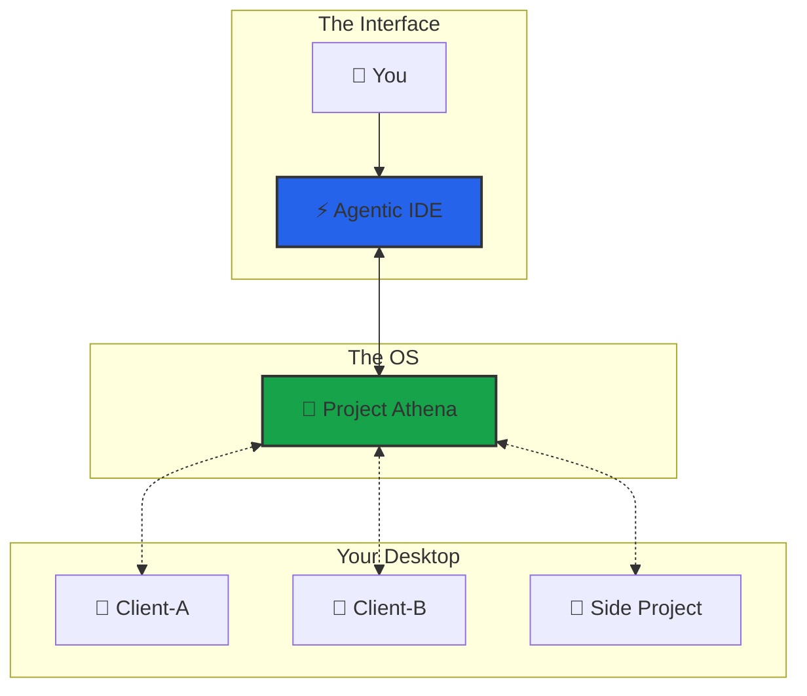
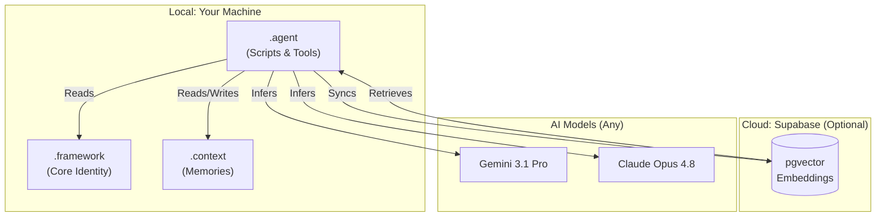

# 🏗️ Architecture Overview

Athena is the **Operating System for AI Agents** — a Hybrid RAG system that keeps your data locally (Markdown) and optionally syncs to the cloud (Supabase) for fast semantic retrieval.

*Last Updated: 2026-07-01 · v9.9.5*

---

## 🧠 The OS Analogy

> **Athena is not a coding assistant. It is the infrastructure that gives AI agents state, structured reasoning, and governed autonomy.**

| OS Layer | Linux | Athena |
|----------|-------|--------|
| **Kernel** | Hardware abstraction | Memory persistence + retrieval (Hybrid RAG, Supabase) |
| **File System** | ext4, NTFS | Markdown files, session logs, tag index |
| **Scheduler** | cron, systemd | Heartbeat daemon, auto-indexing |
| **Shell** | bash, zsh | MCP Tool Server, `/start`, `/end`, `/think` |
| **Permissions** | chmod, users/groups | 4-level capability tokens + Secret Mode |
| **Package Manager** | apt, yum | Protocols, skills, workflows |

---

## 🏛️ The Hub Architecture

Athena is a central brain that connects to external project folders.

| Component | Role |
|-----------|------|
| **Athena** | The OS — memory, scheduling, governance |
| **External Folders** | The Body — client projects, side projects |
| **Agentic IDE** | The Nervous System — compute & interface |

### Workspace Modes

| Mode | Setup | Best For |
|:-----|:------|:---------|
| **Standalone (Recommended)** | Open `Athena/` as your workspace | Personal brain, all-in-one users |
| **Multi-Root (Sidecar)** | Open your project → add `Athena/` folder | Devs with existing repos |
| **Nested** | Drop your project inside `Athena/` | Quick prototypes |

> **Tip**: Start with **Standalone**. Graduate to Multi-Root when you need your project visible in the same window.

---

## 🧩 System Layers

Three primary layers:

1. **The Soul (`.framework/`)**: Immutable laws, identity core, operating principles.
2. **The Brain (`.context/`)**: Long-term memory — session logs, case studies, user profile, active context.
3. **The Hands (`.agent/`)**: Executable scripts, tools, protocols, workflows.

### The Biological Stack (v9.9.1+)

Athena also models itself after the human body — built bottom-up by the creator, used top-down by the user:

| Biology | Athena | What It Does |
|---------|--------|-------------|
| Atom | Rule / Axiom | Smallest indivisible truth (`Law #1: No Irreversible Ruin`) |
| Molecule | Protocol (`.md`) | Rules composed into a reusable procedure |
| Cell | Skill | Self-contained executable unit |
| Organ | Cognitive Cluster | Multi-skill unit for one cognitive domain (15 clusters) |
| Organ System | Cognitive System | Multi-cluster orchestration for a human need archetype (8 systems) |
| Organism | Athena | The complete synthetic intelligence |

The **8 Cognitive Systems** (Survival, Life Decision, Trading, Social, Execution, Growth, Learning, Maintenance) are dispatched by an **Intent Classifier** (P508) that routes by *human need archetype*, not keywords. See [P507: Cognitive Systems](https://github.com/winstonkoh87/Athena-Public/blob/main/examples/protocols/architecture/507-cognitive-systems.md) for details.

---

## 🔌 MCP Server (v9.9.5)

9 tools + 2 resources via [Model Context Protocol](https://modelcontextprotocol.io/). Dual transport (stdio + SSE).

| Tool | Permission | Description |
|------|-----------|-------------|
| `smart_search` | read | Hybrid RAG with RRF fusion |
| `agentic_search` | read | Multi-query decomposition + validation |
| `quicksave` | write | Save checkpoint to session log |
| `health_check` | read | System health audit |
| `recall_session` | read | Read session log content |
| `governance_status` | read | Triple-Lock compliance state |
| `list_memory_paths` | read | Memory directory inventory |
| `set_secret_mode` | admin | Toggle demo mode |
| `permission_status` | read | Show access state & tool manifest |

---

## ⚡ The Retrieval Pipeline (Hybrid RAG)

Five live channels fused via Reciprocal Rank Fusion (RRF) — **Vector is the only semantic channel**; the rest are lexical (filename/keyword-based):

1. **Canonical Search**: Keyword match against `CANONICAL.md` (materialized decisions/frameworks).
2. **Vector Search** *(semantic)*: Chunk-level embeddings (`gemini-embedding-001`, 3072-dim) via Supabase pgvector, cosine similarity.
3. **SQLite Search**: Local file + tag index.
4. **Filename Search**: Project-root keyword matching.
5. **Framework Docs Search**: `.framework/` + memory-bank + `.context/` lookup.

Results are reranked using a **CrossEncoder** (`cross-encoder/ms-marco-MiniLM-L6-v2`) and scored by an **Adaptive Router** (query-complexity-based channel weighting).

> **Result**: Athena finds the *meaning*, not just the word — though semantic recall is currently bounded by what's embedded in Supabase (see [SEMANTIC_SEARCH.md](https://github.com/winstonkoh87/Athena-Public/blob/main/docs/SEMANTIC_SEARCH.md) for the honest breakdown).
>
> *Two channels — a Tags index and a GraphRAG knowledge-graph pass — were retired in June 2026 as dead weight (zero functional contribution). This page previously described them as active; corrected here.*

---

## 🛠️ Tech Stack

| Layer | Technology | Purpose |
|:------|:----------|:--------|
| **SDK** | `athena` Python package (v9.9.5) | Core search, reranking, memory |
| **Reasoning** | Gemini 3.1 Pro (High) / Claude Opus 4.8 (Thinking) / GPT-5.5 (High) | Multi-model reasoning |
| **Reranking** | Cross-Encoder (`cross-encoder/ms-marco-MiniLM-L6-v2`) | Second-stage reranking after RRF fusion |
| **IDE / Agent** | Antigravity, Cursor, Claude Code, Gemini CLI, VS Code | Agentic development environment |
| **Embeddings** | `gemini-embedding-001` (3072-dim) | Google embedding model |
| **Memory** | Supabase + pgvector (chunk-level, exact-scan) | Vector database |
| **Routing** | Risk-Proportional Triple-Lock (SNIPER / STANDARD / ULTRA) | Adaptive latency by query complexity |
| **File Watcher** | Watchdog (event-driven) | Auto-index on file change |

> *GraphRAG (NetworkX + Leiden + ChromaDB) was formally removed in June 2026 — dead 16 months, zero functional contribution. Removed from this table; previously listed here as active.*
